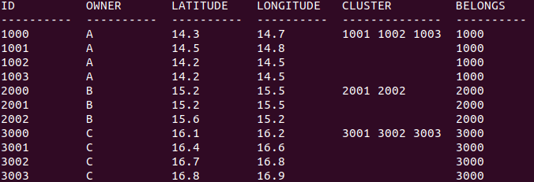

Team 1034A Backend Demo

To store all the information we have about the sheeps, such as the owner, location, or the cluster information, we used a SQLite database. We also wrote a python code that can modify or process the information in the database.

Below, you can see all the cases we tested for the database.
### Initial Database
This is the initial database we created

##### ID
Each sheep has a unique ID and when a new leader sheep is added, the ID is increased by 1000 to denote a new leader sheep. 
##### Owner
The owner column shows which owner the sheep belongs to. 
##### Latitude and Longitude
The latitude and the longitude columns show the position of the sheep. 
##### Cluster
The cluster column is empty for the follower sheeps and for the leader sheeps it shows which sheeps are currently in the cluster belonging to that specific leader sheep.
##### Belongs
The belongs column shows which leader sheep each follower sheep belongs to.

### Jekyll Themes

Your Pages site will use the layout and styles from the Jekyll theme you have selected in your [repository settings](https://github.com/emrecagin05/emrecagin05.github.io/settings/pages). The name of this theme is saved in the Jekyll `_config.yml` configuration file.

### Support or Contact

Having trouble with Pages? Check out our [documentation](https://docs.github.com/categories/github-pages-basics/) or [contact support](https://support.github.com/contact) and we’ll help you sort it out.
